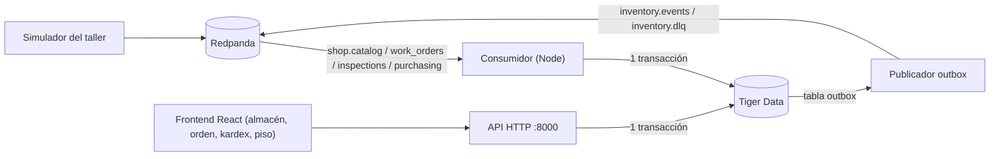

# Plan de Implementación — Almacén Inteligente Hackstreet

> Documento vivo para el equipo. **Regla de oro:** si este plan y `hackathon-inventario-kit/contract/` no coinciden, **gana el contrato**.

## 1. Qué se califica y dónde ponemos el esfuerzo

| Criterio | Pts | Cómo se mide | Lo que entregamos |
|---|---|---|---|
| Libro mayor | 25 | Pruebas de contrato (automáticas) | `movements` inmutable + `balances`, idempotencia, salidas, transferencias, conteos, kardex |
| Integración con el taller | 25 | Pruebas de contrato (automáticas) | Reservas/faltantes desde inspecciones, compras, bajas, anulaciones, desorden, concurrencia |
| Experiencia en piso | 20 | Jurado | Vista móvil con escaneo Code 128 por cámara: retirar, transferir, contar en pocos toques |
| Decisiones justificadas | 15 | Jurado | `docs/DECISIONES.md` (1 página) |
| Extras | 15 | Jurado | Smart Procurement, alertas de voz ElevenLabs, costo promedio, observabilidad |

**Prioridad:** primero los 50 puntos automáticos (se pueden correr las veces que queramos), luego piso, luego documento, al final extras.

## 2. Stack

| Capa | Tecnología | Motivo |
|---|---|---|
| Broker | Redpanda del kit (`localhost:19092`) | Ya lo dan; API de Kafka |
| Servicio | Node.js 20 + `kafkajs` + `express` + `pg` | Un solo proceso: consumidor, publicador outbox y API en puerto **8000** |
| Base de datos | Tiger Data (PostgreSQL) | Transacciones, `FOR UPDATE`, `ON CONFLICT` |
| Frontend | React + Vite + Tailwind | Pantallas de almacén, orden, kardex y piso móvil |
| Escaneo | `BarcodeDetector` con fallback a `html5-qrcode` | Code 128 desde el celular |
| Extras | ElevenLabs (voz), IA para Smart Procurement | Puntos de "Extras" |

> [!NOTE]
> Solana, Vultr y Backboard.io quedan **fuera del alcance base**. Vultr es candidato para el despliegue final si sobra tiempo.

## 3. Arquitectura



### Patrones obligatorios

1. **Idempotencia** — `processed_events(event_id PK)` se inserta **en la misma transacción** que los efectos. Si choca por duplicado → rollback y no se hace nada (regla 19).
2. **Libro mayor** — `movements` (solo INSERT) + `balances(part_id, location_id, on_hand, reserved)` actualizado en la misma transacción. El saldo siempre = suma de movimientos.
3. **Sin negativos ni reservas dobles** — `UPDATE balances ... WHERE on_hand - reserved >= $q` o `SELECT ... FOR UPDATE`. Aplica igual a `POST /issues` concurrentes (regla 8, prueba `concurrencia`).
4. **Reconstruible** — nada de `now()` ni aleatorios en la lógica. Todo sale de `occurred_at`. Los `event_id` de salida se generan con **UUIDv5(event_id de entrada + índice)** para que sean deterministas.
5. **Desorden entre tópicos** — si falta la pieza, orden o línea del BOM, el evento va a `pending_events` y se reintenta cuando llega lo que faltaba. Tras N reintentos → `inventory.dlq` (reglas 20–21).
6. **Outbox** — los eventos `stock.*` se escriben en `outbox` dentro de la transacción; un publicador aparte los manda a Kafka y los marca como publicados.
7. **Arranque** — consumir `shop.catalog` **hasta el final** antes de los demás tópicos (regla 22).

## 4. Esquema de base de datos (nuevo `database/schema.sql`)

> [!IMPORTANT]
> Los IDs de negocio (`part_id`, `location_id`, `work_order_id`, `bom_line_id`, `inspection_id`…) **vienen en los eventos**, por eso son `INT PRIMARY KEY` y no `SERIAL`. Solo las tablas internas (movements, outbox, etc.) usan `BIGSERIAL`.
> Se eliminan los **lotes FIFO**: el contrato mide saldo por (pieza, ubicación), no por lote.

| Tabla | Propósito | Llave |
|---|---|---|
| `parts` | Catálogo (`sku` puede ser null o repetido), `sku_norm` para comparar | `part_id` |
| `locations` | Ubicaciones; `U-100` (id 100) = recepción | `location_id` |
| `bom_lines` | Lista de partes por modelo (`qty_per_unit`, `group_name`) | `bom_line_id` |
| `work_orders` | Órdenes + **`deleted_at`** (marca de baja) | `work_order_id`, `code` único |
| `inspections` | Inspecciones + **`voided_at`** (marca de anulación) | `inspection_id` |
| `needs` | Necesidad vigente por línea: cantidad requerida, inspección de origen | `(work_order_id, bom_line_id)` |
| `reservations` | Reservas activas/liberadas/`fulfilled`, cantidad reservada y entregada | `reservation_id`; único `(work_order_id, bom_line_id)` |
| `shortages` | Faltantes abiertos/cerrados (`part_id` y `missing_quantity` pueden ser null) | `id` |
| `balances` | Saldo por pieza y ubicación | `(part_id, location_id)` |
| `movements` | Kardex inmutable: `receipt`, `issue`, `transfer_out`, `transfer_in`, `adjustment` | `movement_id` |
| `processed_events` | Idempotencia | `event_id` |
| `pending_events` | Eventos en espera de dependencias, con contador de intentos | `event_id` |
| `outbox` | Eventos de salida pendientes de publicar | `id` |
| `unmatched_receipts` | Recepciones sin relacionar + estado de resolución | `id` |
| `policies` | Mínimo, máximo, punto de reorden, tiempo de entrega (sembradas) | `part_id` |
| `reorder_suggestions` | Sugerencia vigente por pieza | `part_id` |

> [!NOTE]
> **Reserva a nivel pieza vs. ubicación:** el contrato permite reservar a nivel pieza y reportar `reserved = 0` por ubicación. Propuesta: guardar la reserva a nivel pieza (en `reservations`) y calcular `available = Σ on_hand − Σ reserved`. Es más simple y evita decidir de qué estante se aparta.

## 5. Reglas del contrato → dónde se implementan

| Regla | Comportamiento | Prueba |
|---|---|---|
| 1, 4 | Solo `inspection.approved` y solo `action = buy` crean necesidad. `repair`, `ok`, `submitted`, `rejected`, `discarded` no hacen nada | `lineas_que_no_reservan`, `rechazo_y_anulacion` |
| 2, 3 | Necesidad por `(orden, bom_line_id)`: **reemplaza**, no suma. Si sube reserva la diferencia; si baja libera. Líneas no mencionadas conservan su necesidad. `items: []` no cambia nada | `necesidad_se_reemplaza` |
| 5 | `quantity: null` → `qty_per_unit` del BOM; si también es null → faltante con `missing_quantity: null` | `lineas_que_no_reservan` |
| 6 | `part_id: null` → `stock.shortage_detected` con `part_id: null`, nunca reserva | `lineas_que_no_reservan` |
| 7, 8 | Reservar `min(disponible, necesidad)`; el resto es faltante. `available` nunca < 0 | `reserva_faltante_compra_y_salida`, `concurrencia` |
| 9 | `purpose = customer_order` → ignorar por completo | `compra_para_cliente` |
| 10 | Normalizar `part_number` (trim, mayúsculas, espacios colapsados) vs `sku`. 0 o >1 coincidencias → `stock.unmatched_receipt` | `recepcion_sin_relacionar` |
| 11 | Entrada siempre en **U-100 (location_id 100)** → `stock.received` | `recepcion_basica` |
| 12 | Surtir faltantes: primero los de `work_order_code` (si la orden vive), luego del más antiguo al más nuevo → `stock.reserved` + `stock.shortage_resolved` | `reserva_faltante_compra_y_salida` |
| 13 | `inspection.voided` → liberar reservas y cerrar faltantes de líneas cuya necesidad vino de esa inspección | `rechazo_y_anulacion` |
| 14 | `work_order.deleted` → liberar todo y cerrar faltantes. **Marca `deleted_at`** para ignorar aprobaciones tardías | `baja_de_orden`, `desorden` |
| 16 | `POST /issues` consume primero la reserva de esa orden; 409 si no alcanza el saldo de la ubicación | `salida_sin_negativos` |
| 17 | `POST /counts` con motivo obligatorio (422 sin motivo); único caso de `available` negativo | `transferencia_y_conteo` |
| 18 | Sugerencia vigente con `suggested_quantity ≥ Σ faltantes`, `work_order_ids`; `stock.reorder_suggested` al nacer o cambiar | — |
| 19–22 | Idempotencia, pendientes, DLQ, catálogo primero | `idempotencia`, `desorden` |
| 23 | Reconstrucción idéntica de `on_hand` | `snapshot` / `compare` (jurado) |

## 6. API HTTP (nombres exactos de `openapi.yaml`)

| Método | Ruta |
|---|---|
| GET | `/parts/{part_id}/availability` |
| GET | `/parts/{part_id}/ledger` |
| GET | `/work-orders/{code}/materials` |
| GET | `/shortages?work_order_code=&part_id=` |
| GET | `/reorder-suggestions` |
| GET | `/unmatched-receipts` |
| POST | `/unmatched-receipts/{id}/resolve` |
| POST | `/issues` |
| POST | `/transfers` |
| POST | `/counts` |

Convenciones: listas como `{"items": [...]}`, errores como `{"detail": "..."}`, fechas UTC con `Z`, importes como texto.

Rutas extra nuestras (permitidas): `/parts?search=`, `/scan/{code}` (resuelve código escaneado → pieza o ubicación), `/locations`, `/procurement/{part_id}` (extra), `/health` y `/metrics` (observabilidad).

## 7. Estructura del backend

```
backend/
├── src/
│   ├── index.js            # arranca API + consumidor + publicador
│   ├── db.js               # pool pg + helper withTransaction
│   ├── kafka/
│   │   ├── consumer.js     # catálogo primero, luego el resto
│   │   ├── publisher.js    # outbox → inventory.events / inventory.dlq
│   │   └── pending.js      # reintentos de eventos en espera
│   ├── handlers/           # un archivo por familia de eventos
│   │   ├── catalog.js  workOrders.js  inspections.js  purchasing.js
│   ├── domain/
│   │   ├── ledger.js       # movimientos + balances
│   │   ├── reservations.js # necesidad, reservas, faltantes
│   │   ├── reorder.js      # sugerencias
│   │   └── events.js       # sobre de salida, UUIDv5, llaves
│   └── api/routes.js
├── scripts/replay-jsonl.js # carga data/events.jsonl sin broker
└── .env.example
```

## 8. Pantallas (frontend)

1. **Piso (móvil, prioridad alta)** — escanear ubicación → escanear pieza → acción **Retirar / Transferir / Contar** con cantidad grande y botón de confirmar. Si un `sku` es de dos piezas, pedir elegir. Aviso de voz si se abre un faltante.
2. **Almacén** — saldo por pieza y ubicación, faltantes abiertos, sugerencias de compra, recepciones sin relacionar (con botón resolver).
3. **Orden de trabajo** — `/work-orders/{code}/materials`: requerido, reservado, entregado, faltante por línea; kits agrupados por `group_name`.
4. **Kardex** — movimientos de una pieza del más reciente al más antiguo con saldo corrido.

## 9. Extras (solo cuando las pruebas pasen)

- **Smart Procurement** — sobre cada sugerencia de compra: historial de precios real (sale de `purchase.item_received.unit_price`), proveedores y tiempos de entrega **sembrados** (no llegan por eventos), y verificación de stock disponible o reparación interna. Recomienda la opción que evita sobreinventario.
- **Alertas de voz ElevenLabs** — al detectar `stock.shortage_detected`, el frontend reproduce un aviso generado.
- **Valuación a costo promedio** — con `unit_price` de las recepciones.
- **Observabilidad** — lag del consumidor, eventos en `pending_events`, DLQ y errores en `/metrics` + un panel.

## 10. Decisiones a documentar (`docs/DECISIONES.md`)

| Tema | Propuesta |
|---|---|
| Kits | Inventariar por `part_id`; el kit solo agrupa para mostrar |
| Servicios (`SERVICIO`) | No se inventarían: generan necesidad/faltante pero no reserva física (por confirmar) |
| Políticas | Sembradas en `policies` (no llegan por eventos); usadas para sugerencias |
| Reserva | A nivel pieza, `reserved = 0` por ubicación |
| Relación de compras | Normalización trim + mayúsculas + espacios colapsados |
| Llaves de salida | Código de orden, `part:<id>` o `purchase_line:<id>` según el schema |

## 11. Orden de trabajo y reparto sugerido

| # | Paso | Responsable sugerido |
|---|---|---|
| 1 | Levantar kit (`docker compose up -d`), consumir `shop.catalog` y ver el flujo en consola | Backend |
| 2 | Esquema, idempotencia, recepciones, salidas, transferencias, conteos, kardex | Backend |
| 3 | Reservas y faltantes desde inspecciones + liberaciones (voided/deleted) | Backend |
| 4 | Correr pruebas de contrato en bucle hasta pasar | Backend |
| 5 | Vista móvil de piso con escaneo | Frontend (puede empezar en paralelo con datos mock) |
| 6 | Pantallas de almacén, orden y kardex | Frontend |
| 7 | Documento de decisiones + ensayo de demo de 5 min | Todos |
| 8 | Extras | Quien termine primero |

## Preguntas abiertas para el equipo

> [!IMPORTANT]
> 1. **Tiger Data**: ¿ya tenemos la instancia en la nube con su cadena de conexión, o desarrollamos con un Postgres local en Docker y migramos después?
> 2. **Servicios (familia `SERVICIO`)**: ¿los tratamos como inventariables o solo como faltante/compra?
> 3. **Reparto**: ¿quién toma backend y quién frontend?

## Verificación

- `docker compose run --rm contract-tests --api http://host.docker.internal:8000` en bucle hasta 14/14 escenarios.
- `tools/validate_events.py` sobre lo que publicamos en `inventory.events`.
- Prueba de reconstrucción: `snapshot` → borrar BD → releer desde cero → `compare`.
- Ensayo de la demo: aprobar inspección en el simulador → reserva → faltante → llegada de compra → salida escaneada desde el celular.
